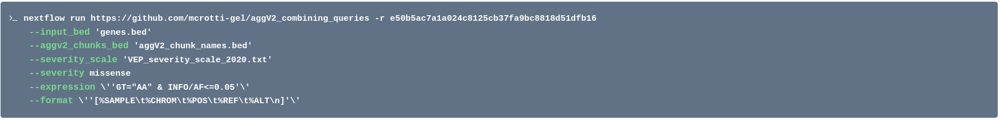
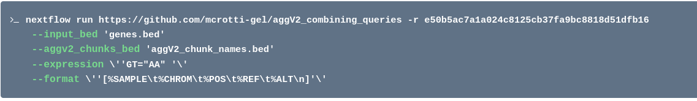

# Combine genotype and functional annotation queries

This workflow allows you to extract variants and samples that comply to both a set of genotype and functional annotation filters, by 
intersecting the genotype VCFs with the functional annotation VCFs.

## Table of contents
- [Pipeline overview](#pipeline-overview)
- [Required inputs](#required-inputs)
  * [input_bed](#input_bed)
  * [agg_chunks_bed](#agg_chunks_bed)
  * [expression](#expression)
  * [format](#format)
- [Optional inputs](#optional-inputs)
  * [severity_scale](#severity_scale)
  * [severity](#severity)
  * [cpus](#cpus)
  * [memory](#memory)
- [Outputs](#outputs)
- [Examples](#examples)

## Pipeline overview
The pipeline has the following main processes:
* find_chunk: finds the genomic and functional annotation agg chunks of interest.
* extract_variant_vep: filters the annotation agg vcfs.
* intersect_annotation_genotype_vcf: intersects the genomic vcf with the filtered annotation vcf.
* find_samples: finds samples of interest.
* summarise_output: produces summary tables.

## Required inputs

### input_bed

This is a region file of your genes of interest. This must be a three or column tab-delimited file of chromosome, start, and stop (with an option fourth column of an identifier - i.e. a gene name). The file should have the .bed extension. 

Example of `input_bed` file:

```bash
chr2	213005363	213151603	IKZF2
chr7	50304716	50405101	IKZF1
```

### agg_chunks_bed

This is the list of chunk names and full file paths to both the genotype and functional annotation VCFs for either aggV2 or aggCOVID. These can be found under
`GEL data resources > aggregate_file_lists > aggV2_chunk_names.bed`
and
`GEL data resources > aggregate_file_lists > aggCOVID_chunk_names.bed`

### expression

This parameter defines the bcftools filter of your query. See bcftools `EXPRESSIONS` for accepted filters https://samtools.github.io/bcftools/bcftools.html#expressions.

### format

This parameter defines the format of the query, see https://samtools.github.io/bcftools/bcftools.html#query for details. For the process to run, you should add the following fields `'[%SAMPLE\t%CHROM\t%POS\t%REF\t%ALT\n]'`, but you can also specify additional fields after the initial list.

### cpus

Number of cpus to be used by each nextflow process. The default is set to 1 cpu per process, but when using and `input_bed` file with > 5 entries please set it to a higher value.

### memory

Total RAM available for each nextflow process. The default is set to 2.GB per process, but when using and `input_bed` file with > 5 entries please set it to a higher value.


## Optional inputs

### severity_scale

This file lists the severity of variants. It can be found under
`GEL data resources > aggregations > gel_mainProgramme > somAgg > v0.2 > additional data > vep severity scale > VEP_severity_scale_2020.txt`. Provide this file if interested only in variant with a specific consequence.

### severity

With this parameter we choose the severity of variants we are interested in for our query. For example, if you want look only at missense variants or worse, the input value would be `missense`. Only use if the parameter `severity_scale` is set.


## Outputs

This workflows produces three ouputs for each gene in your input bed file. 
* `*_result.tsv` file: this is a tab-delimited output from `bcftools query` command.
* `*_platekey_summary.tsv` file: this is a two-column tab-delimited file, where one column is the list of platekeys recovered by the query, and the second column is the number of variants per each participant that satisfied the query.
* `*_variant_summary.tsv` file: this is a two-column tab-delimited file, where one column is the list of variants that satisfied the query, and the second column is the number of participants that have that query.


## Examples

### Example 1

An example question would be: "I want to extract the samples in aggV2 who are homozygous alt for missense (or worse) rare variants within the gene IKZF1". 

The final command would look like this:



### Example 2

An example question would be: "I want to extract the samples in aggV2 who are homozygous alt for any type of variant within the gene IKZF1". 

The final command would look like this:


